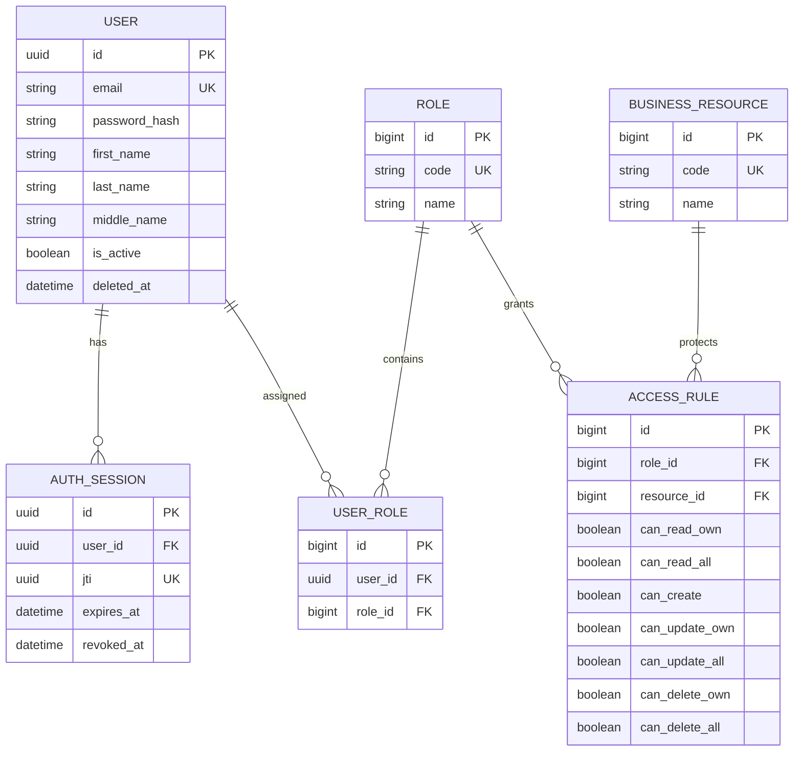

# Backend Authentication and RBAC

Backend-приложение на Django REST Framework. В проекте реализованы:

- регистрация и вход по email и паролю;
- bcrypt-хеширование паролей;
- JWT-аутентификация;
- выход из системы с отзывом серверной сессии;
- мягкое удаление аккаунта;
- изменение ФИО в профиле (email после регистрации не меняется);
- ролевой доступ к ресурсам с разделением прав `own` и `all`;
- API администратора для изменения ролей, ресурсов и правил;
- тестовые ресурсы для проверки авторизации.

## Аутентификация и авторизация

**Аутентификация** отвечает на вопрос «кто выполняет запрос». После входа сервер
выдаёт Bearer JWT. Кастомный `JWTAuthentication` проверяет подпись токена,
обязательные claims, пользователя и активную сессию.

**Авторизация** отвечает на вопрос «может ли этот пользователь выполнить
действие». Она вычисляется по ролям пользователя, коду ресурса, действию и
принадлежности объекта.

- пользователь не определён: `401 Unauthorized`;
- пользователь определён, но права нет: `403 Forbidden`.

Стандартные Django groups/permissions и Django login/session не используются
как основная система доступа.

## JWT и AuthSession

Сам по себе JWT действует до `exp` и не может быть немедленно отозван сервером.
Поэтому каждый access token содержит `jti`, а в таблице `auth_sessions`
создаётся связанная запись.

При каждом защищённом запросе проверяются:

1. схема заголовка `Authorization: Bearer <token>`;
2. подпись JWT и claims `sub`, `jti`, `iat`, `exp`, `type`;
3. активность пользователя;
4. наличие, срок жизни и отсутствие `revoked_at` у `AuthSession`.

При выходе заполняется `revoked_at`, поэтому тот же JWT сразу перестаёт работать.
При мягком удалении отзываются все активные сессии пользователя.

## Схема базы данных



Уникальные ограничения:

- `User.email`;
- `AuthSession.jti`;
- `Role.code`;
- `BusinessResource.code`;
- пара `UserRole(user, role)`;
- пара `AccessRule(role, resource)`.

## Поля разрешений

| Поле | Разрешение |
|---|---|
| `can_read_own` | читать собственные объекты |
| `can_read_all` | читать любые объекты |
| `can_create` | создавать объекты |
| `can_update_own` | изменять собственные объекты |
| `can_update_all` | изменять любые объекты |
| `can_delete_own` | удалять собственные объекты |
| `can_delete_all` | удалять любые объекты |

Права нескольких ролей объединяются по OR. Отсутствие подходящего правила
означает deny.

## Алгоритм own/all

```text
CREATE:
  can_create

READ:
  can_read_all OR (can_read_own AND owner_id == user.id)

UPDATE:
  can_update_all OR (can_update_own AND owner_id == user.id)

DELETE:
  can_delete_all OR (can_delete_own AND owner_id == user.id)
```

Для списка сервис возвращает область:

- `ALL` — вернуть все элементы;
- `OWN` — оставить элементы с `owner_id == user.id`;
- `NONE` — вернуть `403`.

Для неизвестного действия доступ запрещается. API управления доступом проверяет
наличие роли `admin`. Эту роль нельзя удалить, а последнее активное назначение
роли администратора нельзя снять с пользователя.

## Быстрый запуск через Docker

Требуются Docker и Docker Compose.

```powershell
Copy-Item .env.example .env
docker compose up --build -d
docker compose exec api python manage.py migrate
docker compose exec api python manage.py seed_demo
docker compose exec api pytest
```

Приложение: `http://localhost:8000`.

Swagger UI: `http://localhost:8000/api/docs/`.

OpenAPI schema: `http://localhost:8000/api/schema/`.

Остановка:

```powershell
docker compose down
```

Полное удаление локальной БД:

```powershell
docker compose down -v
```

## Локальный запуск без Docker

Без переменной `POSTGRES_HOST` используется SQLite. Если `.env` уже создан по
инструкции для Docker, удалите или закомментируйте в нём строку
`POSTGRES_HOST=db`. Docker-конфигурация использует PostgreSQL.

```powershell
py -3.12 -m venv .venv
.\.venv\Scripts\Activate.ps1
python -m pip install -e ".[dev]"
python manage.py migrate
python manage.py seed_demo
python manage.py runserver
```

## Миграции

Применить существующие миграции:

```powershell
python manage.py migrate
```

Проверить, что модели не требуют новой миграции:

```powershell
python manage.py makemigrations --check --dry-run
```

## Демонстрационные данные

Команда идемпотентна: повторный запуск не создаёт дубли и восстанавливает
ожидаемые локальные роли, назначения и правила.

```powershell
python manage.py seed_demo
```

Эти учётные записи предназначены только для локальной проверки:

| Роль | Email | Пароль | Доступ |
|---|---|---|---|
| admin | `admin@example.com` | `AdminPass123!` | управление правилами, все mock-ресурсы |
| manager | `manager@example.com` | `ManagerPass123!` | чтение и изменение всех orders |
| user | `user@example.com` | `UserPass123!` | создание и работа со своими orders |
| guest | `guest@example.com` | `GuestPass123!` | нет прав, демонстрация `403` |

Ресурсы: `orders`, `products`, `access_rules`.

## API

Все прикладные эндпоинты имеют префикс `/api/v1`.

| Метод | Endpoint | Доступ |
|---|---|---|
| POST | `/auth/register/` | любой |
| POST | `/auth/login/` | любой |
| POST | `/auth/logout/` | аутентифицированный |
| GET, PATCH, DELETE | `/users/me/` | аутентифицированный |
| GET, POST | `/access/roles/` | admin |
| GET, PATCH, DELETE | `/access/roles/{id}/` | admin |
| GET, POST | `/access/resources/` | admin |
| GET, PATCH, DELETE | `/access/resources/{id}/` | admin |
| GET, POST | `/access/rules/` | admin |
| GET, PATCH, DELETE | `/access/rules/{id}/` | admin |
| GET, PUT | `/access/users/{user_id}/roles/` | admin |
| GET, POST | `/mock/orders/` | по правилу `orders` |
| GET, PATCH, DELETE | `/mock/orders/{id}/` | по правилу `orders` и owner |
| GET | `/mock/products/` | по правилу `products` |

## Примеры запросов

### Регистрация

```powershell
curl.exe -X POST http://localhost:8000/api/v1/auth/register/ `
  -H "Content-Type: application/json" `
  -d '{"email":"new@example.com","first_name":"Иван","last_name":"Иванов","middle_name":"","password":"StrongPass123!","password_repeat":"StrongPass123!"}'
```

### Вход и защищённый запрос

```powershell
$login = curl.exe -s -X POST http://localhost:8000/api/v1/auth/login/ `
  -H "Content-Type: application/json" `
  -d '{"email":"user@example.com","password":"UserPass123!"}' |
  ConvertFrom-Json

$token = $login.access_token

curl.exe http://localhost:8000/api/v1/users/me/ `
  -H "Authorization: Bearer $token"
```

### Демонстрация 401

```powershell
curl.exe -i http://localhost:8000/api/v1/mock/orders/
```

Ожидается `401 Unauthorized`.

### Демонстрация 403

```powershell
$guest = curl.exe -s -X POST http://localhost:8000/api/v1/auth/login/ `
  -H "Content-Type: application/json" `
  -d '{"email":"guest@example.com","password":"GuestPass123!"}' |
  ConvertFrom-Json

curl.exe -i http://localhost:8000/api/v1/mock/orders/ `
  -H "Authorization: Bearer $($guest.access_token)"
```

Ожидается `403 Forbidden`.

### Собственные и все объекты

User видит только Order A и получает `403` на Order B:

```powershell
curl.exe http://localhost:8000/api/v1/mock/orders/ `
  -H "Authorization: Bearer $token"

curl.exe -i http://localhost:8000/api/v1/mock/orders/2/ `
  -H "Authorization: Bearer $token"
```

Manager видит оба заказа:

```powershell
$manager = curl.exe -s -X POST http://localhost:8000/api/v1/auth/login/ `
  -H "Content-Type: application/json" `
  -d '{"email":"manager@example.com","password":"ManagerPass123!"}' |
  ConvertFrom-Json

curl.exe http://localhost:8000/api/v1/mock/orders/ `
  -H "Authorization: Bearer $($manager.access_token)"
```

### Logout

```powershell
curl.exe -i -X POST http://localhost:8000/api/v1/auth/logout/ `
  -H "Authorization: Bearer $token"
```

Повторное использование `$token` вернёт `401`.

## Тесты и проверки

```powershell
pytest -v
python manage.py check
python manage.py makemigrations --check --dry-run
ruff check .
ruff format --check .
```

Полная проверка на чистой PostgreSQL:

```powershell
docker compose down -v
docker compose up --build -d
docker compose exec api python manage.py migrate
docker compose exec api python manage.py seed_demo
docker compose exec api pytest
```

## Компромиссы

- Реализован access token без refresh token.
- Mock orders/products не сохраняют изменения и явно возвращают `"mock": true`.
- SQLite используется только как локальный fallback; основной Docker-сценарий
  работает с PostgreSQL.
- Административный доступ основан на bootstrap-роли `code="admin"`.
- Аудит изменений правил, rate limiting и CI не входят в обязательную часть
  тестового задания.
- Django admin присутствует как инфраструктура фреймворка, но прикладная
  аутентификация и авторизация на нём не основаны.
